# Component Diagram

## System Architecture Overview

This diagram shows the components involved in the RAG chatbot solution and their interactions from the time a question is received until a response is generated.

```mermaid
graph TB
    %% User Interface
    UI[👤 User Input] --> MS{Menu Selection}
    
    %% Data Sources
    WEB[🌐 promtior.ai]
    PDF[📄 AI Engineer.pdf]
    
    %% Core Pipeline
    MS --> QP[🔍 Query Processing]
    WEB --> WS[Web Scraper]
    PDF --> PP[PDF Processor] 
    WS --> TS[Text Splitter]
    PP --> TS
    TS --> EM[🔢 Embeddings]
    EM --> VS[(🗄️ Vector Store)]
    
    %% RAG Process
    QP --> VSS[🎯 Vector Search]
    VSS --> VS
    VS --> CR[📚 Context Retrieval]
    CR --> LLM[🧠 LLM Processing]
    LLM --> RG[✨ Response]
    RG --> UD[📱 Display]
    
    %% Cache Logic
    VS --> CM{Cache Valid?}
    CM -->|Yes| LC[💾 Load Cache]
    CM -->|No| RB[🔄 Rebuild]
    LC --> VSS
    RB --> VSS
    
    %% Styling
    classDef ui fill:#e3f2fd,stroke:#1976d2,stroke-width:2px
    classDef data fill:#e8f5e8,stroke:#388e3c,stroke-width:2px
    classDef process fill:#fff3e0,stroke:#f57c00,stroke-width:2px
    classDef storage fill:#fce4ec,stroke:#c2185b,stroke-width:2px
    classDef decision fill:#ffecb3,stroke:#ffa000,stroke-width:2px
    
    class UI,MS,UD ui
    class WEB,PDF,WS,PP data
    class QP,TS,EM,VSS,CR,LLM,RG process
    class VS,LC,RB storage
    class CM decision
```

